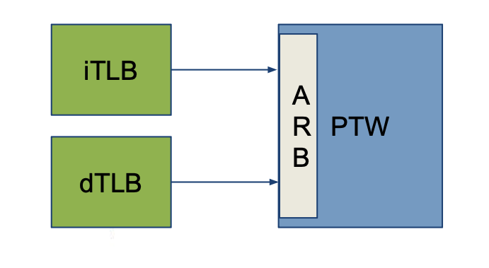

# Memory Management Unit (MMU)

This repository includes a Translation Lookaside Buffer (TLB) and a Page Table Walker, both forming a Memory Management Unit. The modules are designed to be used in a RISC-V processor, following the page-based 39-bit Virtual-Memory System specification (SV39).

	 

#### - TLB characteristics:
- Page-based SV39 mode by default
- Virtual Address (39-bit) to Physical Address (56-bit) translation
- TLB entries are parametrizable (8 by default) in includes/mmu_pkg.sv
- Checks Access Permissions
- Raises Page Fault Exceptions

#### - PTW characteristics:
- Support for kilo (4KB), mega (2MB) and giga (1GB) page-size
- 3 level tree hierarchy   
- Mealy FSM following the steps mentioned in the "Virtual Address Translation Process" chapter (4.3.2) of the [RISC-V privileged specs](https://riscv.org/technical/specifications/):

	 

