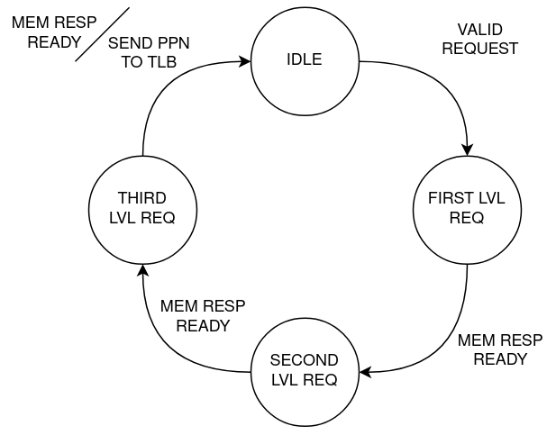

# Memory Management Unit (MMU)

This repository includes a Translation Lookaside Buffer (TLB) and a Page Table Walker, both forming a Memory Management Unit. The modules are designed to be used in a RISC-V processor, following the page-based 39-bit Virtual-Memory System specification (SV39).

	 

#### - TLB characteristics:
- Page-based SV39 mode
- Virtual Address (39-bit) to Physical Address (56-bit) translation
- Checks Access Permissions (Segmentation Faults)
- Raises Page Fault Exceptions

#### - PTW characteristics:
- Only 4KB page-size support
- Mealy FSM:

	 

